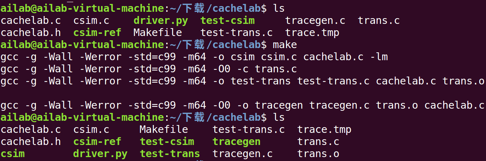
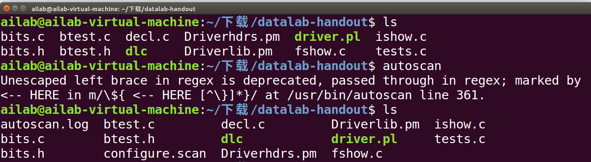
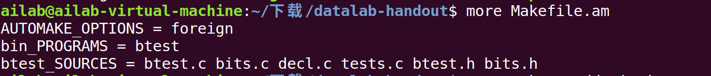
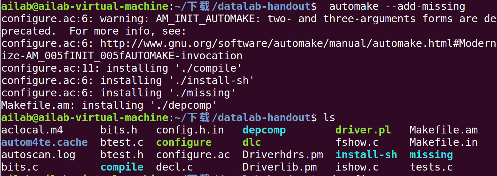
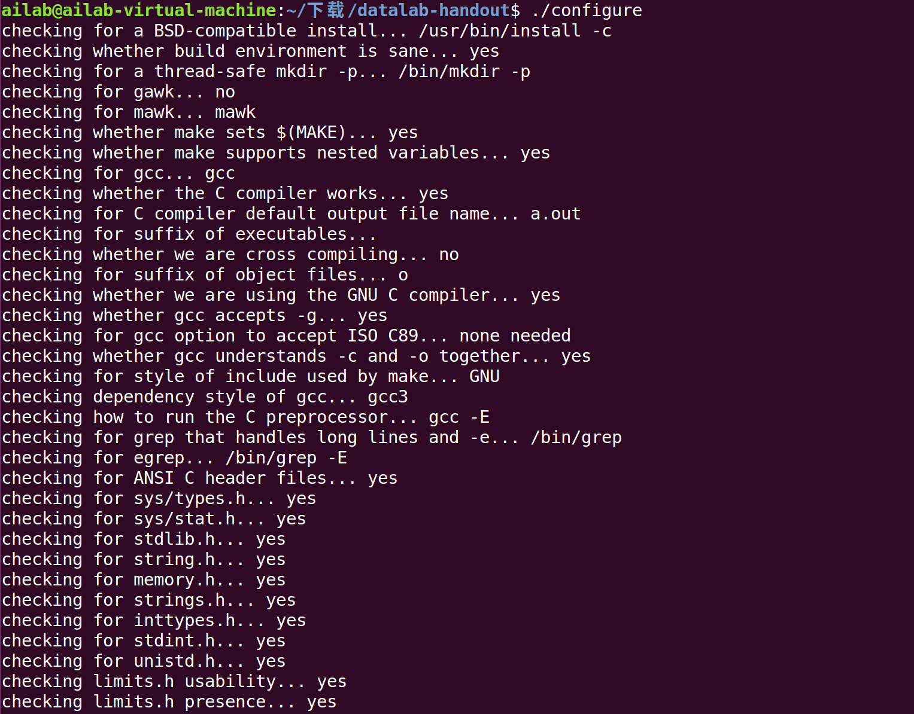
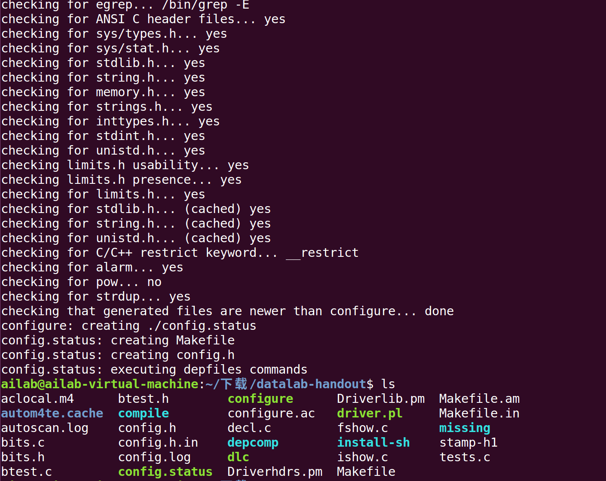
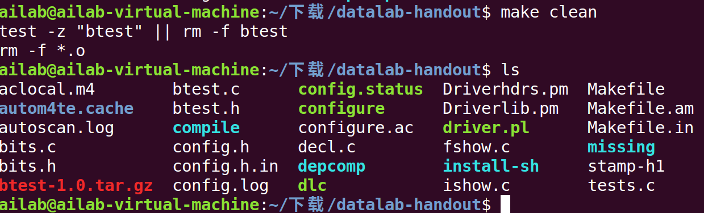

# Linux-Course-Sonorous
# 实验题目：lab1:构建主机端开发环境（上） #
小组名称：内里没有核

小组成员：颜宇辰，史杰，林鹏

## 一、实验目的 ##
1.在建立交叉编译开发平台之前,首先需要建立主机(虚拟机/PC,或双系统)开发环境;

2.学会使用本地gcc编辑应用程序;

3.学会使用Makefile管理应用程序;

4.学会通过autotools生成Makefile;

5.学会通过git/github管理团队软件和工作文件;

## 二、实验内容 ##
1.安装主机(虚拟机/PC)Linux开发环境,Fedora,Ubuntu,Debian均可;

2.编写c应用程序,通过本地gcc编译应用程序,如果是基于x86的主机，gcc输出的执行文件运行的是x86指令集;

3.编写Makefile管理应用程序,为更好体现Makefile的作用,需编写多个c程序,给出说创建的Makefile的内容;

4.通过autotools生成Makefile,完成常用的make操作(make,make install,make uninstall,make dist);

5.创建小组git仓库,github账号,用来存储小组工作文件以及小组报告;学习如何构建github文件,如何上传和下载github文件等。

## 三、实验过程与结果 ##
1.建立主机开发环境
本次实验之前就已安装VMware虚拟机ubuntu16.04,所以本次实验开发环境即为ubuntu16.04;

2.gcc编译应用程序
考虑到重新创建一个简单的应用程序不如在一个之前做过的小项目上进行本次实验来得更具有实用性和启发性,所以本次实验我选择在之前做过模拟cache的小项目上进行,从而有更深刻的体会。
首先按照完整的程序转换过程生成可执行目标文件：输入gcc -E cachelab.c -o cachelab.i,对c程序进行预处理,生成cachelab.i源程序;输入gcc -S cachelab.i -o cachelab.s,编译源文件生成汇编语言程序;输入gcc -c cachelab.s -o cachelab.o,进行汇编生成.o可重定位目标程序,到此都符合预期,但是输入gcc cachelab.o -o cachelab生成可执行目标程序的时候出现了报错,经过分析,发现链接的时候缺少另一个c文件导致,重新输入命令gcc cachelab.c csim.c -o cachelab,从图中可以看出最终成功生成了cachelab可执行目标程序,至此编译完成,这个过程中遇到的问题也充分说明了Makefile的重要性,当文件数量增加的时候,文件之间的依赖关系也会增加,很容易出现我之前出现的错误。当然在减小出错概率的同时也大大提高了我们编译的效率,即便是使用不带参数的gcc直接生成可执行目标文件，当问及数量增加的时候也比较麻烦,在一个文件修改之后可能还重新编译多个文件,make工具就显得非常的方便。

3.编写Makefile管理应用程序
由上一个例子可以看出当文件数量增加的时候,文件之间的依赖关系也会增加,每一个程序分别编译的话不仅容易出错,而且非常麻烦不利于统一管理。下面用Makefile来管理上例中的程序。根据文件之间的依赖关系使用gedit编写的Makefile如下:

通过#编写文档注释,cc=gcc表示使用gcc编译,CFLAGS = -g -Wall -Werror -std=c99 -m64这些CFLAGS指定的值表示编译选项,分别表示在可执行程序中包含标准调试信息,打印出gcc提供的警告信息,求gcc将所有的警告信息当成错误进行处理,指定
c的标准为c99,指定编译为64位应用程序。接下来一行all: csim test-trans tracege可以指定生成可执行目标程序csim,test-trans和tracege,如果把这一行去掉可以发现make的时候只编译生成了csim,所以在生成多个可执行文件的时候使用all方便很多。接下来依次指定了4个target和他们的依赖和命令,在make执行这4行命令,生成指定的target。

可以发现make后命令的执行顺序并不是按照Makefile中编写的顺序来执行的,而是针对依赖关系做出了调整,将生成tracegen需要的trans.o在执行这条命令前就完成了编译,所以在编写Makefile中不用过于担心这个执行顺序的问题了。rm -rf *.o, rm -f csim, rm -f test-trans tracegen分别在make clean的时候删除.0文件和指定的三个可执行目标程序,当然如果不执行make clean的话在下次make的时候只会重新编译修改过的程序,从而使得编译的过程方便了很多。

4.通过autotools生成Makefile
首先通过sudo apt install autoconf命令安装autotools。在创建源文件后运行autoscan命令扫描目录cachelab，生成 configure.scan文件,使用ls查看该目录下会多出autoscan.log configure.scan两个文件,

创建configure.ac文件,将configure.scan重命名为configure.ac,其中的m4宏命令用来分析系统环境,在AC_INIT 定义软件的名称cachelab-homework,版本信息1.0,手动添加AM_INIT_AUTOMAKE, 作为automake必需的宏，创建发布压缩包时会用到,接着添加AC_CONFIG_FILES,用于生成最终的Makefile文件,创建后的configure.ac如图所示

使用aclocal命令扫描 configure.ac文件生成 aclocal.m4文件,获取autoconf
创建configure所需的宏定义:

使用autoconf命令读取configure.ac文件中的宏,生成configure脚本:

使用autoheader命令生成config.h.in文件:

手工创建Makefile.am文件。automake根据configure.ac的参数把
Makefile.am转换成Makefile.in文件:

使用automake命令生成Makefile.in文件。--add-missing选项可以让
automake自动添加必需的模板文件:

使用configure命令把Makefile.in变成最终的Makefile文件:

可以看到生成了Makefile文件

运行make测试生成的目标文件是否正确。以下是运行后的结果,可以看到make产生的命令与我们手工创建的Makefile有所不同,但是依然可以得到我们想要的btest可执行目标程序,运行btest可执行目标程序,得到结果如图,可见得到的可执行目标文件是正确的。

接下来就是使用make install进行安装,但是在安装过程中遇到了如图的报错,经过查询发现因为要向系统写入文件,缺少root权限,需要使用命令sudo make install。make unstall也需要root权限,使用sudo make uninstall。

使用make dist用于生成软件压缩包。可以看到按照我们之前的命名规则生成的压缩包文件。当然生成压缩包在手工创建Makefile的时候也能做到。

自动生成的Makefile中make clean也可以删除需要删除的文件。

## 四、实验总结 ##
1.实验总结收获

之前编译程序的时候也使用过make工具,不过用的时候时候没有去理解其中的原理,所以用的一头雾水的,之前在Makefile中遇到问题要修改参数的时候也只能按照网上的提示一知半解的去解决,本次实验给我提供了一个良好的机会去了解平时接触却没有深入了解的make工具,还第一次使用了autotools工具生成Makefile,当然现在做的项目都比较小,autotools的优势还不明显,可能遇到大型项目要发行版本等问题时优势应该会凸显出来。本次实验总体还是比较顺利的,遇到的两个问题一个是在configure.ac中使用AM_INIT_AUTOMAKE(btest, 1.0)时,由于第三个参数要指定邮箱,没有指定的话会报warning;还有一个问题是make install的时候会出现没有root权限,需要使用sudo make install,通过autotools产生的makefile可读性似乎没有手工生成的那么好,不过应该是我没有掌握其中的规则,这也是我下一步要强化的地方。当然自动生成的 Makefile的效果还是比较好的,也比较出乎我的意料。

2.未解决的问题

首先就是对自动生成的Makefile中间的内容还不太了解,还有在使用autotools过程中生成了很多文件,对有些文件的内容和原理还缺乏深入的了解,也体现了自己还只是刚刚接触冰山一角，需要学习的还有很多。

## 五、实验源码 ##
见文件(host_environment_up.tar.gz)