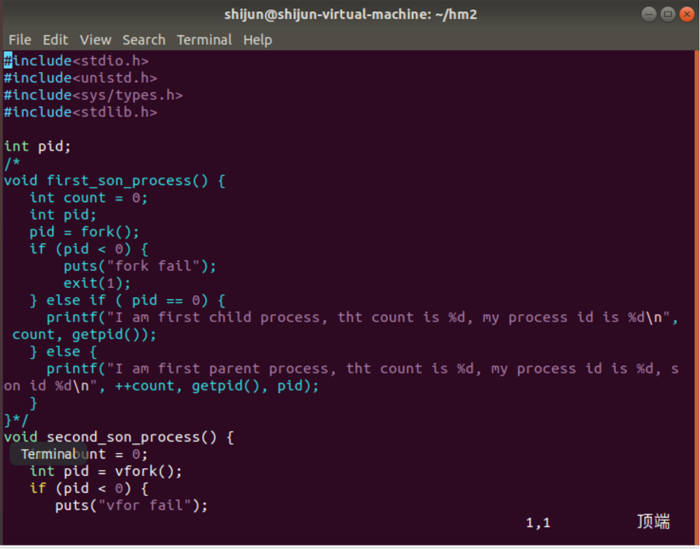
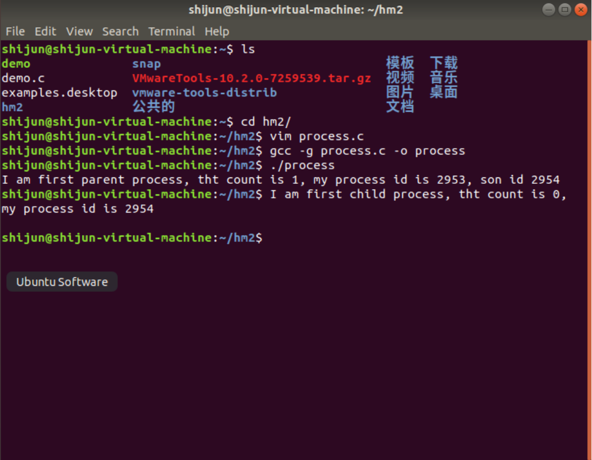
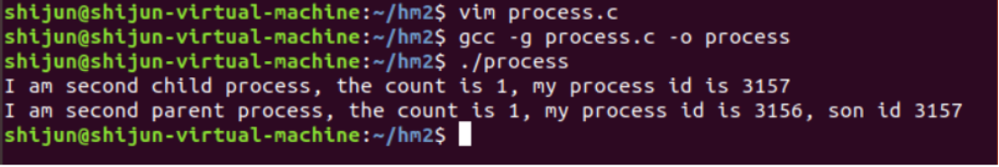
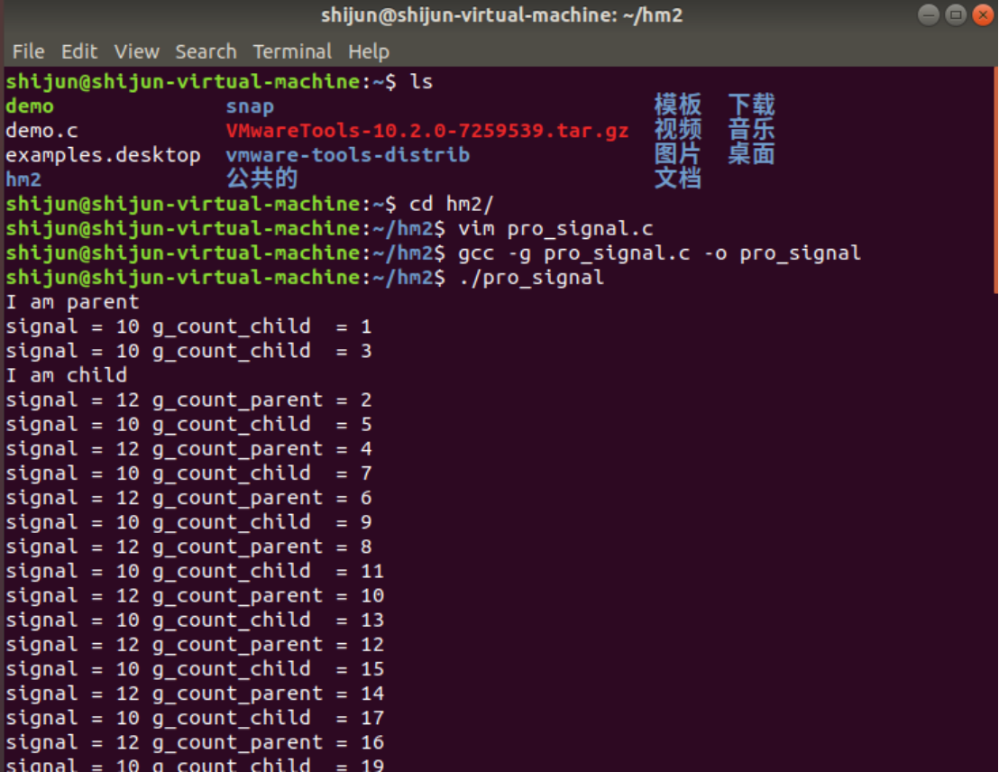
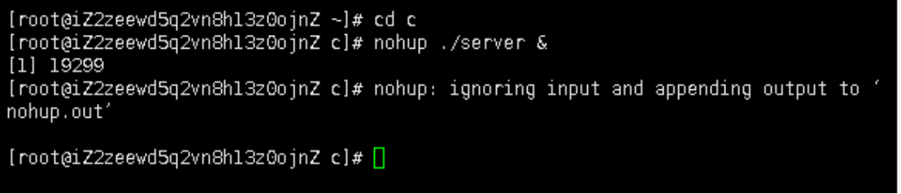
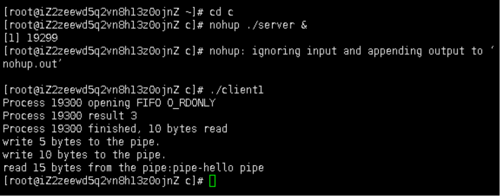

# 多进程编程实验 #

内里没有核

颜宇辰，史杰，林鹏

## 一、实验目的  ##

学会创建多进程程序，理解fork()，vfork() 创建 的子进程的特点。
学会使用有名管道和无名管道实现进程间通信。
学会使用信号机制实现进程间通信。

## 二、实验内容  

1. 编写fork()，vfork()多进程程序，通过输出结果 比较所创建的子进程的不同之处。 
2. 编写fork()多进程程序，进程间模拟信号通信， 包括信号发送、捕捉与处理。 
3. 编写fork()多进程程序，进程间实现有名管道和 无名管道通信。具体要求如下： 
编写1个服务器程序server.c和2个客户端程序client1.c, client2.c ，服务器和客户端之间采用FIFO管道通信； 
服务器和客户端各自创建自己的子进程，父进程负责 完成FIFO管道通信，子进程负责输出接收到的信息， 父子进程间采用无名管道通信。

## 三、实验过程与结果   

（一）
1分别用fork和vfork函数创建子进程（部分代码截屏）

2执行fork函数

3执行vfork函数

（二）编写fork()多进程程序，进程间模拟信号通信， 包括信号发送、捕捉与处理

（三）
开启服务器

开启客户端1和2

## 四、实验总结 总结实验收获 描述未解决的问题  ##

小组合作分工，学习了使用fork（）和vfork（）函数创建进程，了解了这两个函数的区别，通过fork（）与vfork（）创建的进程理解进程与线程的行为特性，学习了进程间的信号和管道通信，掌握基本的进程间通信，使用fifo实现一个服务器端多个客户端通信，掌握基本的多进程编程技术，对课堂内容有了更好的理解。

## 五、附实验源码 ##
见附件