
# Linux-Course-Sonorous
# 实验题目：lab3:多线程编程 #
小组名称：内里没有核

小组成员：颜宇辰，史杰，林鹏

## 一、实验目的 ##
1.掌握基于pthread线程库的多线程编程技术；

2掌握基本的线程间同步技术(sem，mutex)；

3理解共享资源并掌握其操作方法。

## 二、实验内容 ##
读者-写者问题多线程实现

1一个数据集（如数据、文件等）被N个线程读写；

2一些线程只要求读数据集内容，称为读者 (Reader)，实验读者数
不少于6个；

3另些线程要求修改数据集内容，称为写者 (Writer)，实验写者数
不少于3个；

4多个读者可以同时读数据集内容，不需要互斥操作；

5一个写者不能和其他写者或读者同时访问数据集，换句话说，写
者和其他写者或读者之间必须互斥操作；

6读者优先：如果有读者，写者需要等待！用于更新不频繁或更新
影响不显著、读者较多的场合；

7写者优先：如果有写者，读者需要等待！用于更新频繁或更新影
响显著的场合。

## 三、实验过程与结果 ##
1.读者优先
（1）只要有一个读者在读，后续读者可读，写者需要等待全部读者结束才能访问数据

读者优先伪码如下

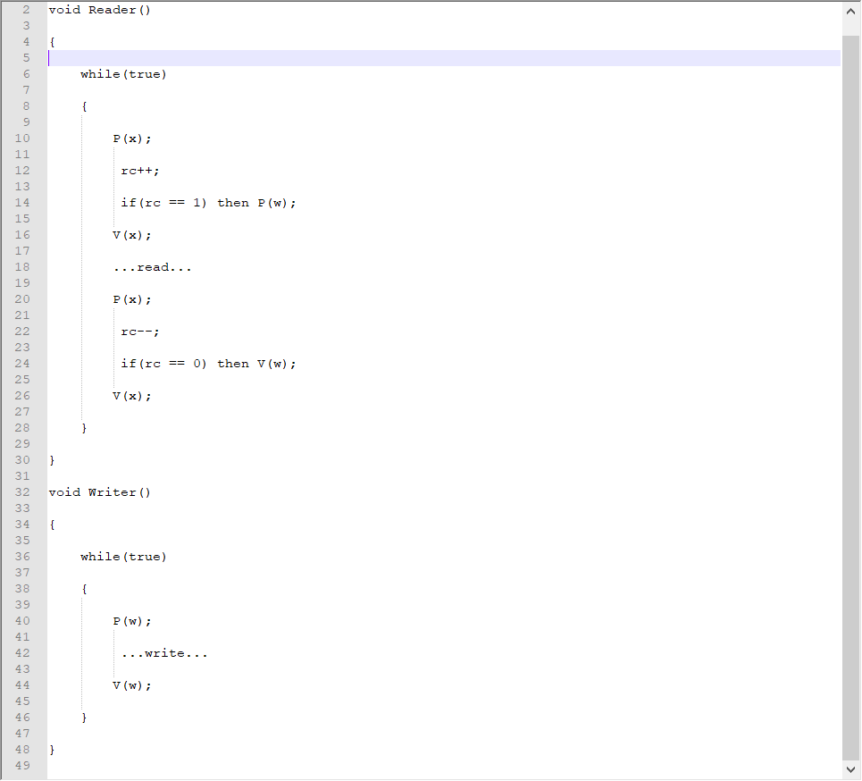

（2）定义读写者数量和读写频率

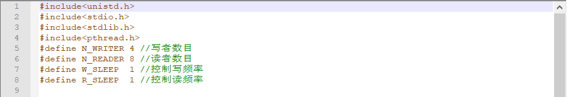

（3）使用互斥量，实现线程间对数据的互斥访问，定义数据初始值为0

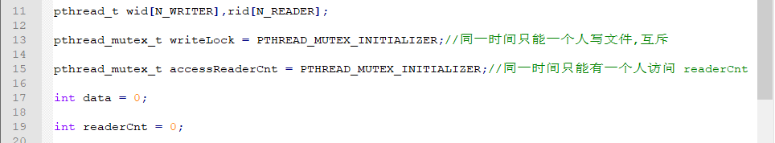

（4）定义读写动作，使用rand()向数据集写入0-1000随机数并输出显示，用pthread_self()得到对应线程号

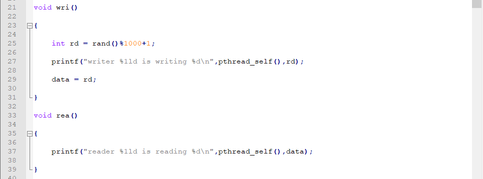

（5）定义写函数

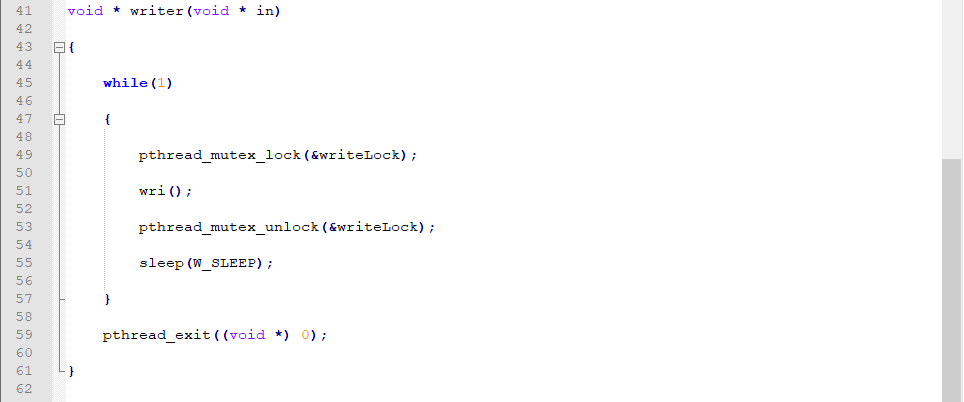

（6）定义读函数，任何读者想读时，写者都会被阻塞，后续任何读者都会优于写者执行，使用readerCnt统计读者数量，使用互斥量accessReaderCnt来互斥各线程对于readerCnt的访问

（7）main函数执行随机线程读写

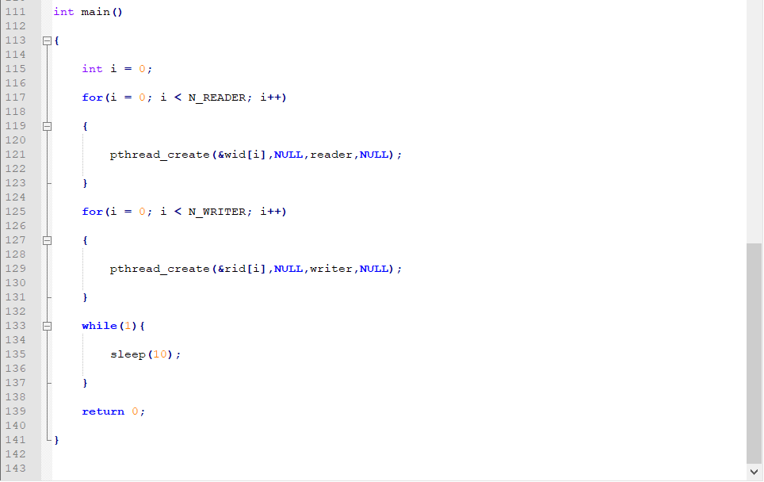

 (8)运行结果

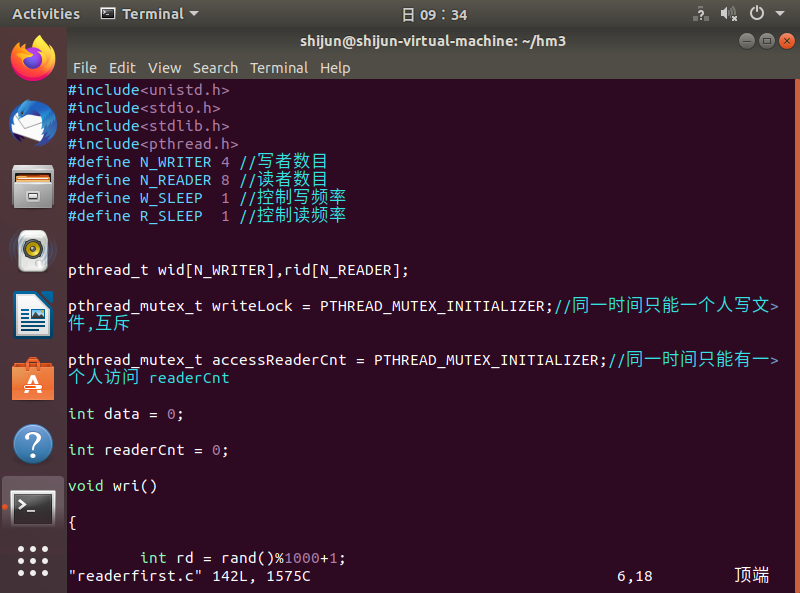

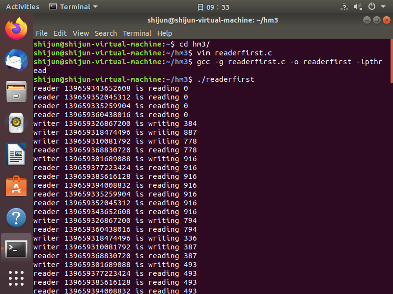

2写者优先（类似与读者优先，简要叙述）

（1）只要有一个写者在读，后续写者可写，读者需要等待全部写者结束才能访问数据

写者优先伪码如下

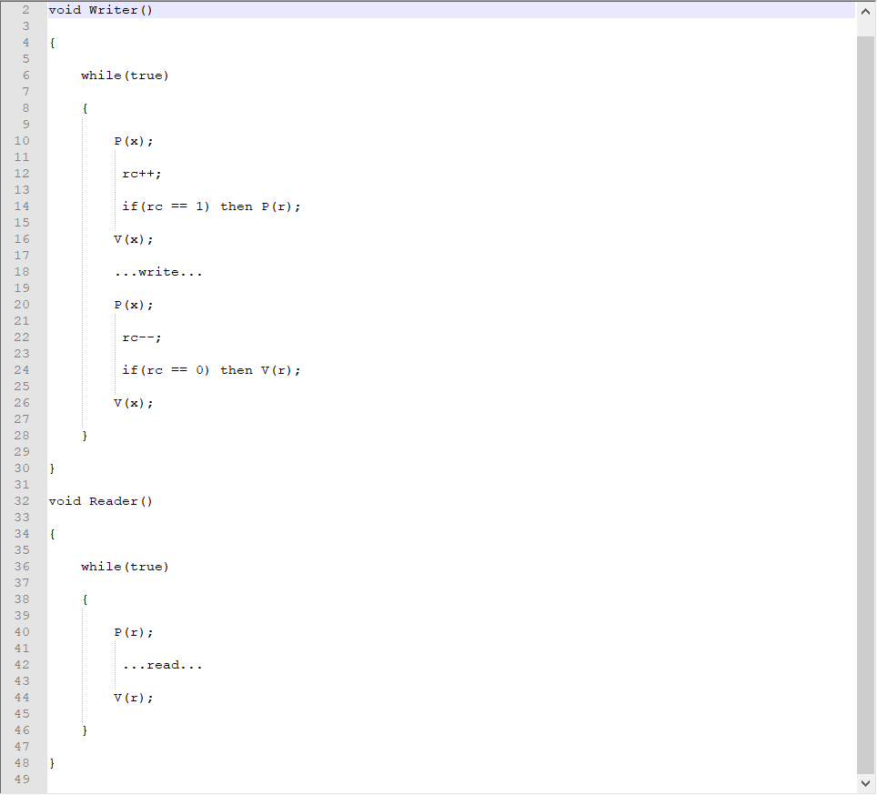

（2）部分程序截图

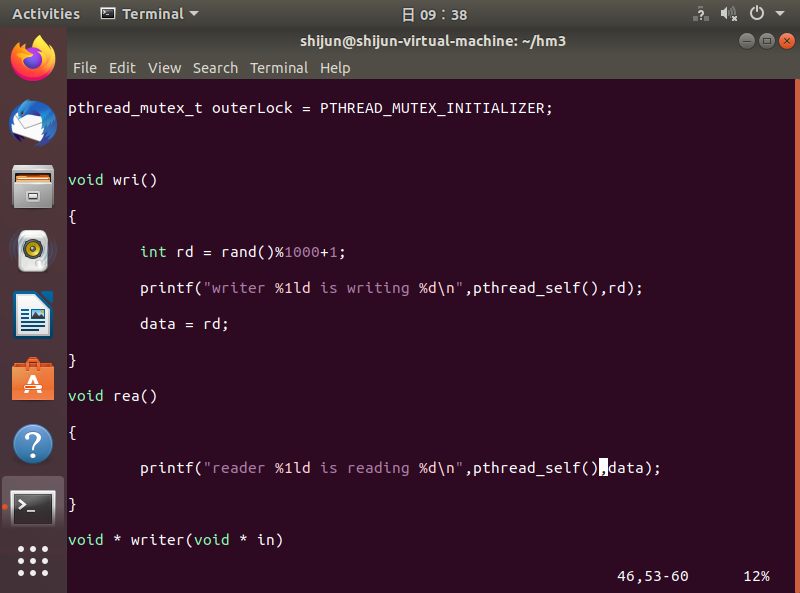

（3）运行结果

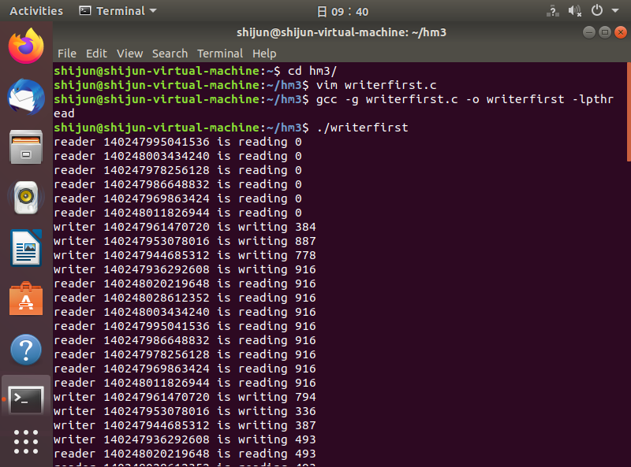
## 四、实验总结 ##
1.实验总结收获

学习了使用pthread线程库的调用和互斥锁，在实验过程中不断改错调整，用pthread_self()函数得到线程Id等，熟悉了基本的多线程编程技术，掌握了基本的线程间同步技术，也更加熟悉了linux系统的编译操作。

2.遇到的问题

按照之前的编译命令 gcc **.c -o **编译遇到报错undefined reference to 'pthread_create'

原因： pthread 库不是 Linux 系统默认的库，连接时需要使用静态库 libpthread.a，在编译命令中要加 -lpthread参数

## 五、实验源码 ##
见文件夹lab3soursecode