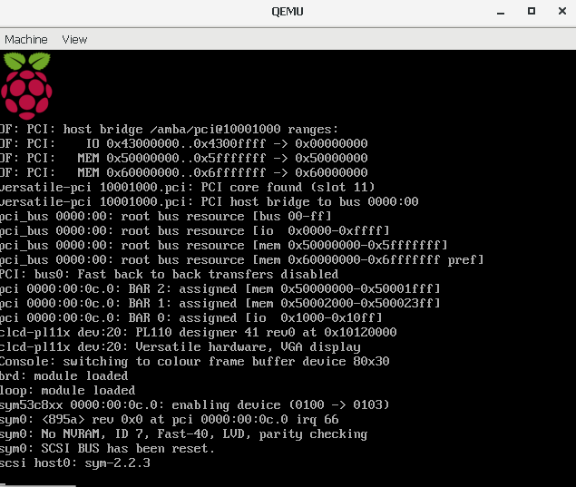
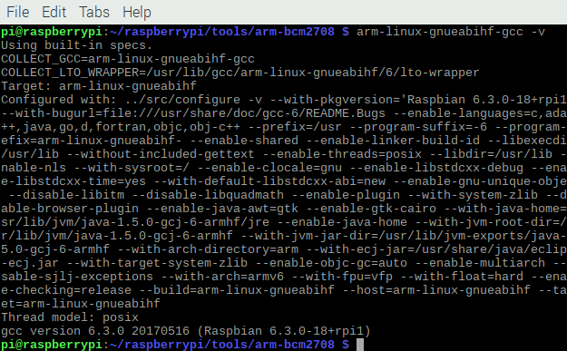
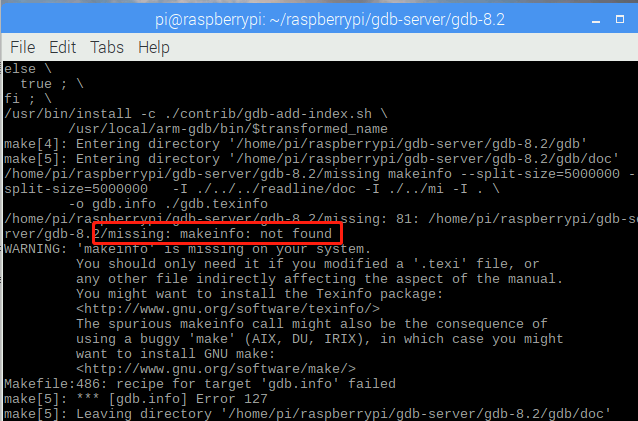
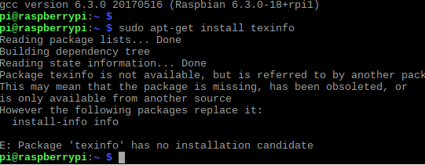
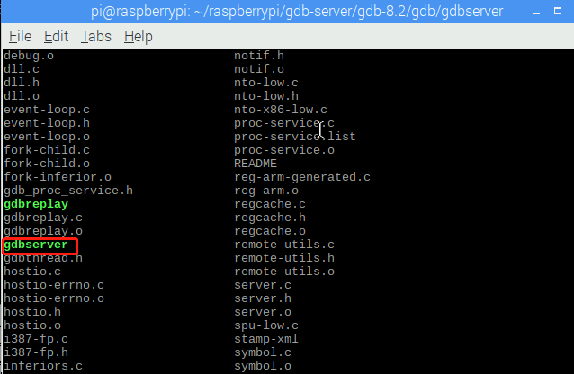
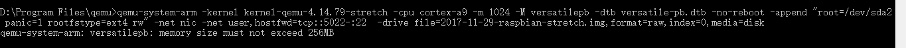

# 构建主机端开发环境实验 #

颜宇辰，史杰，林鹏

## 一、实验目的  ##

1. 学会下载安装Linux及相关工具到目标机或目标机仿真环境。
2. 学会使用交叉编译器编译应用程序，并能够将可执行程序下载到目标机运行。
3. 学会使用交叉调试工具gdb-gdbserver调试应用程序。

## 二、实验内容  

1. Host-Target 方案1： 下载安装Linux系统到开发板，其中包括bootloader、内核、模块、库、文件系统等； 建立host-target连接 ，常见连接有SSH，VNC， Putty。
	
	Host-Target 方案2：下载安装目标机仿真环境qemu， 安装qemu树莓派系统。

2. 构建并测试开发板交叉编译器。
3. 建立gdb-gdbserver交叉调试环境并能够调试应用程序。

## 三、实验过程与结果   

### 下载安装目标机仿真环境qemu， 安装qemu树莓派系统

1. 在[https://www.qemu.org/download/#windows](https://www.qemu.org/download/#windows "QEMU官网")下载windows版的qemu。
2. 在[https://github.com/dhruvvyas90/qemu-rpi-kernel](https://github.com/dhruvvyas90/qemu-rpi-kernel)下载kernel-qemu-4.14.79-stretch和versatile-pb.dtb并拷贝至qemu的安装目录
3. 在[http://downloads.raspberrypi.org/raspbian/images/](http://downloads.raspberrypi.org/raspbian/images/)下载所需的树莓派版本，本次实验选的是2017-11-29-raspbian-stretch.img
4. 在qemu的安装目录编写bat文件，并输入命令： `qemu-system-arm -kernel kernel-qemu-4.14.79-stretch -cpu arm1176 -m 256 -M versatilepb -dtb versatile-pb.dtb -no-reboot -append "root=/dev/sda2 panic=1 rootfstype=ext4 rw" -net nic -net user,hostfwd=tcp::5022-:22 -hda 2017-11-29-raspbian-stretch.img`
5. 运行bat文件，即可成功启动树莓派

	

### 构建并测试开发板交叉编译器

1. 新建文件夹，用于存放交叉编译器

		mkdir raspberrypi
2. 下载交叉编译工具

		git clone git://github.com/raspberrypi/tools.git
	
	可能存在的问题：

	- 下载过程中，由于网络原因可能出现下载速度过慢的情况，使用代理可以加速。

	- 树莓派若出现物理内存空间不足的报错，可以参考[https://blog.csdn.net/talkxin/article/details/81264605](https://blog.csdn.net/talkxin/article/details/81264605)扩容
	> 建议增加4G物理内存，若增加内存过少，安装GDB-Server还会出现内存不足

3. 将编译器加入环境变量

		export PATH=$PATH:$HOME/raspberrypi/tools/arm-bcm2708/gcc-linaro-arm-linux-gnueabihf-raspbian-x64/bin
4. 验证

		arm-linux-gnueabihf-gcc -v

	

### 建立gdb-server交叉调试环境并能够调试应用程序

#### 配置gdb

1. 创建新文件夹存储gdb
	
	    mkdir gdb
		cd gdb
2. 下载gdb文件

		wget http://ftp.gnu.org/gnu/gdb/gdb-8.2.tar.gz
3. 解压

		tar xvzf gdb-8.2.tar.gz
4. 进入解压后的安装包：
	
		cd gdb-8.2
5. 配置环境

		./configure --target=arm-linux --prefix=/usr/local/arm-gdb -v
6. 编译

		make
	此过程需等待较长时间，笔者等了2小时
	
7. 编译过程中出现如下错误,于是尝试下载texinfo

	
	

8. 实验过程中出现source中找不到texinfo,于是更换了源

	
	
9. 下载texinfo
		
		sudo apt-get install texinfo
10. 编译
	
		sudo make install

#### 配置gdb-server

1. 进入/home/pi/gdb-8.2/gdb/gdbserver文件夹
		
		cd /home/pi/gdb-8.2/gdb/gdbserver

2. 配置环境

		export PATH=$PATH:/usr/local/arm-gdb/bin
3. 编译

		make CC=arm-linux-gcc
	
4. 后续的交叉编译测试由于无法实现host和qemu的树莓派通信，以及其他问题，暂时无法完成

## 四、实验总结 总结实验收获 描述未解决的问题  ##

采用qemu的方案未能完成实验，由于无法实现扩容，导致内存极小，运行极其卡顿，且未找到与host通信的方法,导致无法与host端通信，无法完成后续gdb-server的调试实验，由于树莓派真机还没送达，下面的步骤待真机送到后完成

## 五、附实验源码 ##
见附件