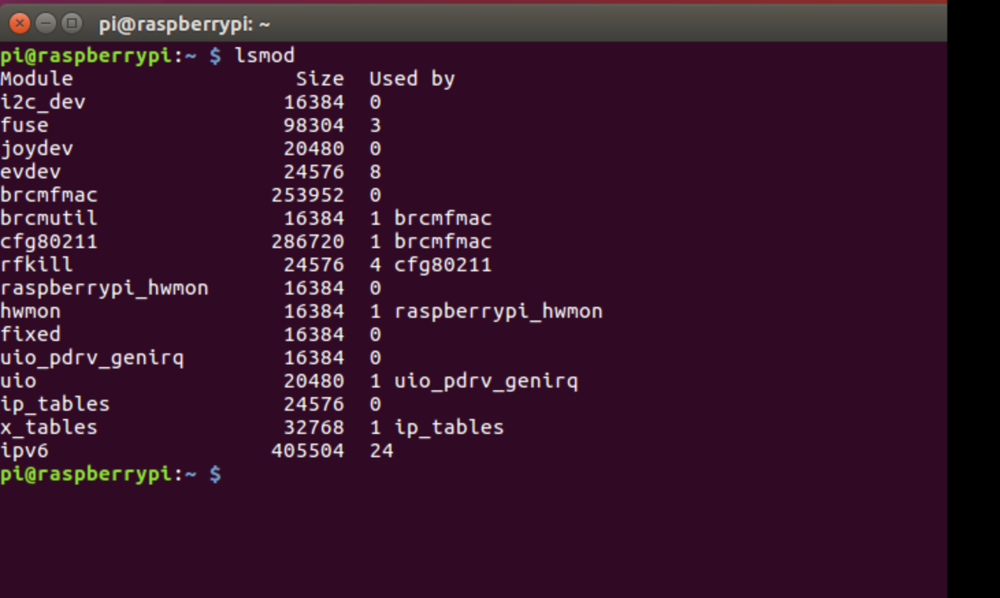
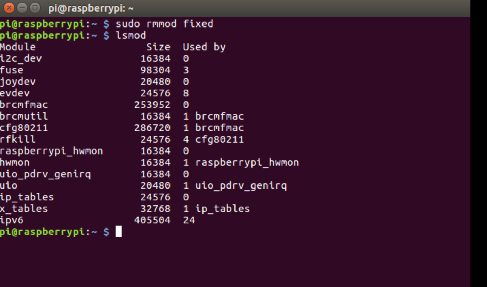
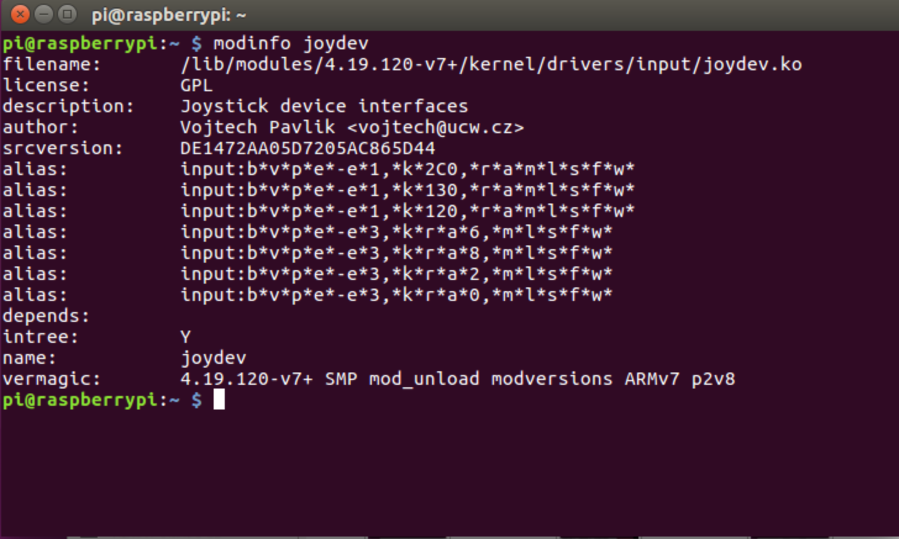
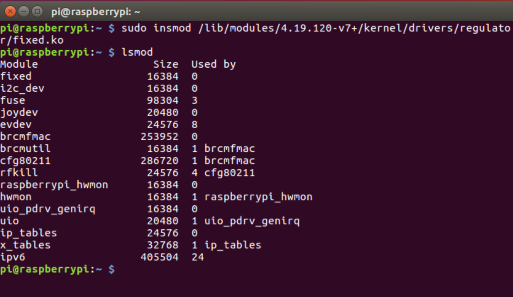
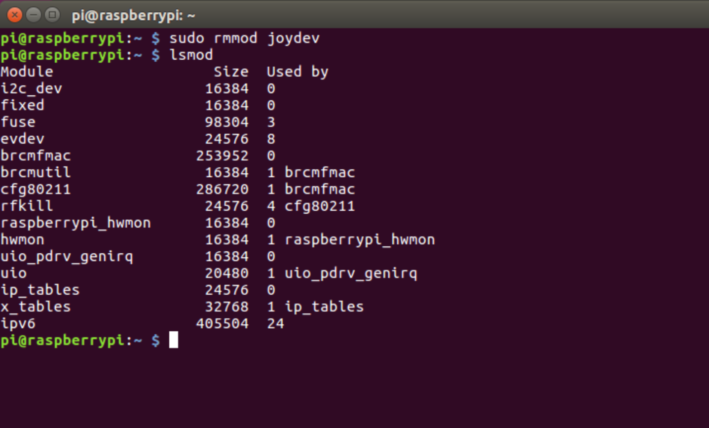
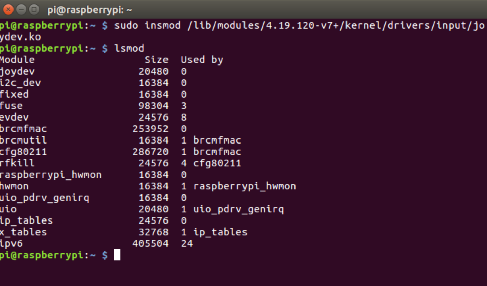
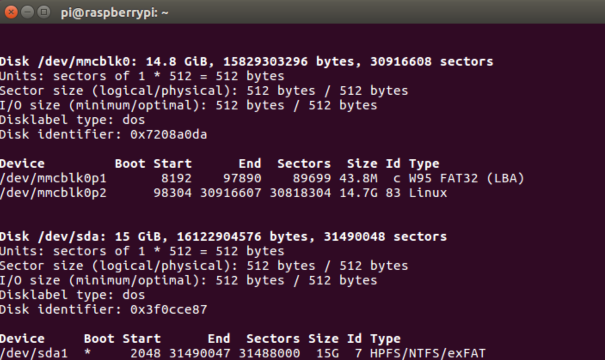

# 构件目标系统 #

史杰，林鹏， 颜宇辰

## 一、实验目的  ##

1、 掌握裁剪Linux内核的方法，理解内核选项的意义；

2、 熟悉编译内核并加载内核到目标系统的方法与过程；

3、 了解模块与内核的关系，掌握内核模块配置编译、安装与卸载流程，为进一步编程，如驱动编程打下基础；

4、 掌握创建、安装(卸载)并使用文件系统的方法。

## 二、实验内容  

1、首先用默认配置重新编译一遍已安装到开发板的内核，将新的内核替换现有内核，检查是否通过；

2、在原始版本基础上，重新配置Linux内核，构建一个嵌入式的Linux内核；

3、编译安装重新配置后的内核、模块及dtbs设备树；

4、针对默认配置中不少于10个kernel feature进行重新配置（裁剪为主、偶有增加），并解释理由：(Y=>N，N=>Y)；

5、保留必要的模块安装，剩余(占多数)取消；(M=>N)；

6、make后将新的内核安装到开发板运行测试；

7、选择至少二个模块加载与卸载，检查是否加载、卸载成功；

8、构建并安装至少一款不同于根文件系统、用于应用开发的其它文件系统。

## 三、实验过程与结果   

### 1.编译内核

构建内核主要有两种方法。第一种是在Raspberry Pi上本地构建，花费的时间或特别长。第二种是交叉编译，速度快，但是设置比较麻烦。这里使用交叉编译的方法构建内核。Linux交叉编译主机使用Ubuntu虚拟机。因为Raspbian也是Debian发行版，两者如命令行等许多方面都相似。

将工具链下载到主文件夹：

	git clone https://github.com/raspberrypi/tools 

更新PATH环境变量可使系统知道交叉编译所需的文件位置。

	echo PATH=\$PATH:~/tools/arm-bcm2708/arm-linux-gnueabihf/bin >> ~/.bashrc source ~/.bashrc
交叉编译工具较快开发的速度。树莓派中已经安装了gcc工具链，可在树莓派中直接编译源代码生成可执行文件。

下载内核源码

	git clone --depth=1 https://github.com/raspberrypi/linux。  
安装工具，
	sudo apt install git bc bison flex libssl-dev make  

因为我们树莓派的型号是3b+，所以使用命令

	cd linux
	KERNEL=kernel7
	make ARCH=arm CROSS_COMPILE=arm-linux-gnueabihf- bcm2709_defconfig

###3.模块的加载与卸载

常用的模块操作指令有：

	(1)lsmod(list module,将模块列表显示)，功能是打印出当前内核中已经安装的模块列表

	(2)insmod（install module，安装模块），功能是向当前内核中去安装一个模块，用法是insmod xxx.ko

	(3)modinfo（module information，模块信息），功能是打印出一个内核模块的自带信息。，用法是modinfo xxx.ko，注意要加.ko，也就是说是一个静态的文件形式。

	(4)rmmod（remove module，卸载模块），功能是从当前内核中卸载一个已经安装了的模块，用法是rmmod xxx.ko  rmmod xxx都可以

查看当前内核中已经安装的模块列表

卸载已安装模块fixed

重新安装刚卸载的模块fixed，获取路径：

安装fixed：

测试卸载然后安装joydev模块

###4.构建并安装文件系统

通过指令fdisk -l查看当前文件系统。可见/dev/mmcblk0为树莓派的TF卡，也是根文件系统所在。/dev/sda为外接的U盘，用于构建新的文件系统。

用mkfs指令将分区格式化为所需要的格式：

## 四、实验总结 总结实验收获 描述未解决的问题  ##

## 五、附实验源码 ##
