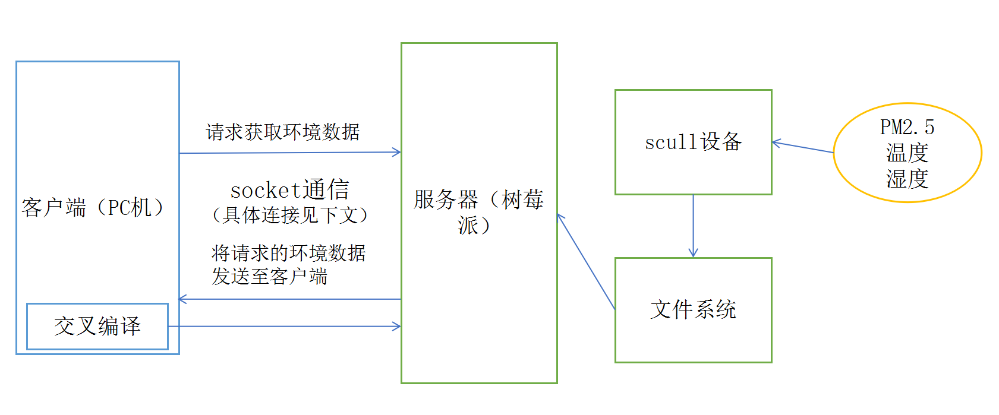
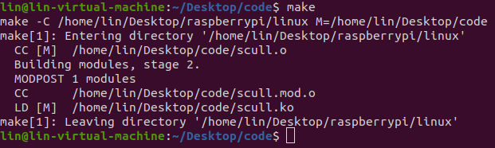
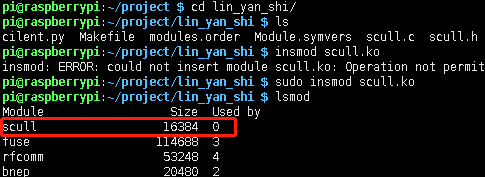
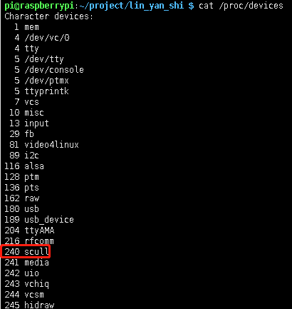
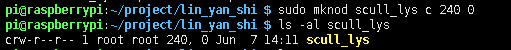
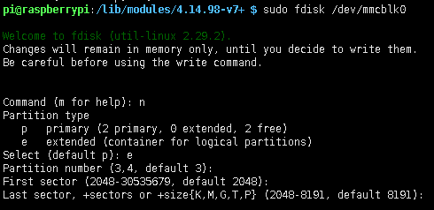
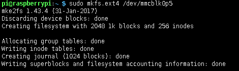
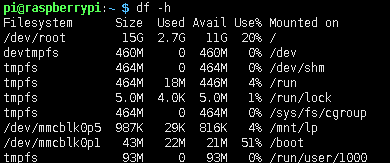
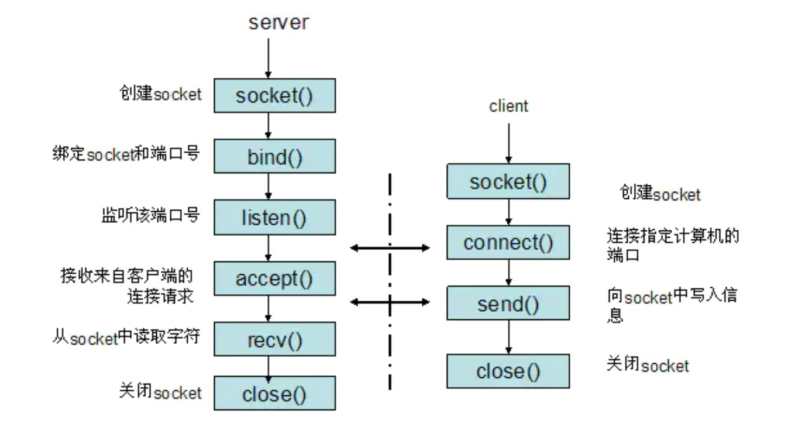
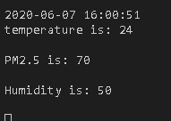

# 综合应用实验 #

史杰，林鹏，颜宇辰

## 一、实验目的  ##

能够综合应用课程所学的技术与工具，包括：

1. Socket通信
2. 多进程、多线程编程
3. 交叉调试目标端程序
4. 磁盘分区与文件系统创建
5. 模块与驱动编程

## 二、实验内容  

1. 将树莓派设为智能家居Linux服务器，可用来采集并维护环境数据，如PM2.5、温度、湿度、气味、电器状态数据等。在实际环境中数据来自相应的传感器，本次试验中用scull设备模拟。

2. 要求创建2个以上的scull设备，设备驱动可选择从内核源码树外(Kbuild)编译安装，或加入到内核源码树内。驱动函数要求包括： open, release, read, write, llseek, ioctl。

3. 实验中的环境数据存储在特定文件系统中。该文件系统要求具备属性：在线写入、持久性、断电可靠性。

4. PC机、移动设备或另外一个树莓派用作远程客户端，随时请求获取环境数据，客户端和服务器之间采用Socket通信。

5. APP编译采用交叉编译，用gdb-gdbserver交叉调试APP。

## 三、实验过程与结果   

### 1. 系统总计架构

智能家居Linux服务器总体架构如图所示：

将PC机作为远程客户端，树莓派做服务器，PC机可以随时向树莓派发送请求获取环境数据，采用TCP协议通信的socket编程，scull设备获取PM2.5、温度、湿度等数据后存入文件系统并读取给服务器，服务器将请求的环境数据传送至客户端。

### 2. 内核配置
由于重装了系统，虚拟机端配置的内核与树莓派不同，所以需要重新配置树莓派的内核，使其与虚拟机上的内核一致，否则在insmod 时会报错。

	git clone --depth=1 https://github.com/raspberrypi/linux
	cd linux
	KERNEL=kernel7
	make ARCH=arm CROSS_COMPILE=arm-linux-gnueabihf- bcm2709_defconfig
	make ARCH=arm CROSS_COMPILE=arm-linux-gnueabihf- zImage modules dtbs

然后装入装有树莓派系统的sd卡，此时由于用的是虚拟机，需要打开USB配置，可以参考

> https://blog.csdn.net/engerla/article/details/83344391

	lsblk

若此时显示了sdb，则表明成功检测到USB设备
依次执行如下指令，将内核文件配置进SD卡中

	mkdir mnt
	mkdir mnt/fat32
	mkdir mnt/ext4
	sudo mount /dev/sdb1 mnt/fat32
	sudo mount /dev/sdb2 mnt/ext4
	sudo make ARCH=arm CROSS_COMPILE=arm-linux-gnueabihf- INSTALL_MOD_PATH=mnt/ext4 modules_install
	sudo cp mnt/fat32/$KERNEL.img mnt/fat32/$KERNEL-backup.img    （备份旧内核）
	sudo scripts/mkknlimg arch/arm/boot/zImage mnt/fat32/$KERNEL.img
	sudo cp arch/arm/boot/dts/*.dtb mnt/fat32/
	sudo cp arch/arm/boot/dts/overlays/*.dtb* mnt/fat32/overlays/
	sudo cp arch/arm/boot/dts/overlays/README mnt/fat32/overlays/
	sudo umount mnt/fat32
	sudo umount mnt/ext4
	kernel=kernel-myconfig.img

将SD卡重新插入树莓派中，重启设备即可完成

### 3. scull设备安装与应用
在内核配置并编译好的基础上，根据课上ppt内容和资料编写文件`scull.c`、`scull.h`、`Makefile`

	make

编译生成的文件移入树莓派中,将模块加载到内核

	insmod scull.ko

使用`cat /proc/devices`察看加载模块对应的设备编号

scull成功加入到内核中，主设备号为240

创建scull设备文件

### 4. 文件系统
因为目前的大部分 Linux 文件系统都默认采用 ext4 文件系统，所以我们选择构建ext4文件系统

创建新的扩展分区，Select选e,表示扩展分区：

	sudo fdisk /dev/mmcblk0

格式化

	sudo mkfs.ext4 /dev/mmcblk0p5：

挂载创建的分区

	sudo mkdir /mnt/lp
	sudo nano /etc/fstab

在文件最后一行，插入
*/dev/mmcblk0p5 /mnt/lp ext4 defaults 0 2*

检查

	sudo mount -a 
	df -j

### 5. socket编程

从总体架构图中可以看出，本系统将PC机作为远程客户端，树莓派做服务器，PC机可以随时向树莓派发送请求获取环境数据，采用TCP协议通信的socket编程，scull设备获取PM2.5、温度、湿度等数据后存入文件系统并读取给服务器，服务器将请求的环境数据传送至客户端。

 Socket是应用层与TCP/IP协议族通信的中间软件抽象层，它是一组接口。是一种"打开—读/写—关闭"模式的实现，服务器和客户端各自维护一个"文件"，在建立连接打开后，可以向自己文件写入内容供对方读取或者读取对方内容，通讯结束时关闭文件。采用TCP协议通信的socket编程流程见下图

其中客户端（PC机）

1. 创建socket
2. 通过调用connect函数建立和服务器的连接
3. 向服务器发送请求环境数据
4. 接受来自服务器的反馈消息
5. 关闭socket
    
    	client.py

    	import time
    	from socket import *
    	
    	serverName = '192.168.1.114'
    	serverPort = 8001
    	while(True):
    		clientSocket = socket(AF_INET, SOCK_STREAM)
    		clientSocket.connect((serverName, serverPort))
    		data = 'client'
    		clientSocket.send(data.encode())
    		data = clientSocket.recv(1024)
    		print(data.decode(), end='')
    		print('\r')
    		time.sleep(5)
	
	

服务器（树莓派）

1. 创建socket
2. 通过bind函数绑定socket和端口号
3. 通过listen函数监听端口号
4. 通过accept接收来自客户端的连接请求
5. 处理来自树莓派的环境数据请求，并向客户端发送数据
6. 关闭socket
		
		server.py
		import socket
		import time
		
		HOST = '192.168.1.114'  # 内网IP地址
		PORT = 8001  # 端口号
		sock = socket.socket(socket.AF_INET, socket.SOCK_STREAM)
		sock.bind((HOST, PORT))
		sock.listen(1)  # 最多连接1个设备
		while True:
		    connection, address = sock.accept()
		    try:
		        buf = ""
		        msg = connection.recv(1024).decode()
		        connection.settimeout(10)
		        if msg == "client":  # 接收成功
		            buf += time.strftime("%Y-%m-%d %H:%M:%S", time.localtime())
		            f = open('/mnt/lp/data.txt')
		            buf += "\ntemperature is: "
		            buf += f.readline()
		            buf += "\nPM2.5 is: "
		            buf += f.readline()
		            buf += "\nHumidity is: "
		            buf += f.readline()
		            f.close()
		            connection.send(buf.encode())
		        else:  # 接收失败
		            connection.send(b'Fail!')
		    except socket.timeout:
		        print('time out!')
		    connection.close()

socket.AF_INET表示用于服务器与服务器之间的网络通信

socket.SOCK_STREAM表示代表基于TCP的流式socket通信

## 四、实验总结 总结实验收获 描述未解决的问题  ##
 这次实验中，我们构建了PC机作为远程客户端，树莓派做服务器的系统，客户端和服务器采用TCP协议通信的socket编程，构建了ext4文件系统，构建了轻量的scull模块，scull设备获取PM2.5、温度、湿度等数据后存入文件系统并读取给服务器，服务器将请求的环境数据传送至客户端。

 小组内将整个实验分成了内核、scull、文件系统、socket通信几部分，分工协作，结合查找资料，综合使用了本课程所学的socket通信、交叉编译、文件系统创建等知识，对所学内容有了更进一步的理解。

## 四、实验源码  ##

 实验源码见文件夹code